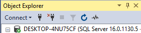

# SQL-Backup-Scripts

## Istruzioni config.txt

- `serverName` – Nome dell’istanza di SQL server



- `dbName` – Nome del database
- `fullBackupDir`, `diffBackupDir`, `logBackupDir` – Percorso per (rispettivamente) backup completi, backup differenziali, backup dei log
- `scriptLogs` – Percorso per i log generati dagli script

Non è necessario che le cartelle esistano già, in caso contrario gli script le creeranno automaticamente; **i percorsi non possono contenere spazi**.

### Esempio

```
dbName=asdf
serverName=DESKTOP-4NU75CF
fullBackupDir=D:\Backup\Backups\Full
diffBackupDir=D:\Backup\Backups\Diff
logBackupDir=D:\Backup\Backups\Logs
scriptLogs=D:\Backup\Logs
```

## Script

- Lo script per il backup completo lo comprime in formato zip dopo la creazione, utilizzando 7zip (nella cartella `7z`); una volta terminata la compressione elimina il file non compresso. Vengono mantenuti due backup, alla creazione del terzo viene prima eliminato il più vecchio.
- I backup differenziali vengono salvati in una cartella nominata con il timestamp dell’ultimo backup completo, da utilizzare come base per il ripristino. Alla creazione di un nuovo backup completo la cartella in questione viene eliminata, e ne viene creata una con il nuovo timestamp per i successivi backup differenziali.
- Vengono mantenuti fino a 100 backup dei log (circa un giorno di backup se viene fatto ogni 15 minuti).

## Schedule

- **SQL Full Backup**: esegue lo script per il backup completo ogni domenica alle 3:00.
- **SQL Diff Backup**: esegue lo script per il backup differenziale ogni giorno alle 4:00.
- **SQL Log Backup**: esegue lo script per il backup dei log ogni 15 minuti.
